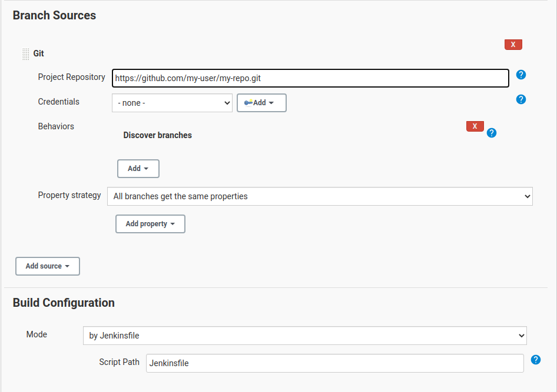

# Apigee CI/CD using Jenkins and Maven

## Goal

Reference implementation for a CI/CD pipeline for Apigee using [Jenkins](https://www.jenkins.io/) and the [Apigee Deploy Maven Plugin](https://github.com/apigee/apigee-deploy-maven-plugin).

The CICD pipeline includes:

-   Git branch dependent Apigee environment selection and proxy naming to allow deployment of feature branches as separate proxies in the same environment
-   Static code analysis using [eslint](https://eslint.org/)
-   Unit testing using [mocha](https://mochajs.org/)
-   Integration testing of the deployed proxy using [apickli](https://github.com/apickli/apickli)
-   Packaging and deployment of the API proxy bundle using [Apigee Deploy Maven Plugin](https://github.com/apigee/apigee-deploy-maven-plugin)

## Target Audience

-   Operations
-   API Engineers
-   Security

## Limitations & Requirements

-   The authentication to the Apigee management API is done using OAuth2. If you require MFA, please see the [documentation](https://github.com/apigee/apigee-deploy-maven-plugin#oauth-and-two-factor-authentication) for the Maven deploy plugin for how to configure MFA.

## Prerequisites

### Jenkins

The setup described in this reference implementation is based in Jenkins. You can either use the included instructions to configure a new Jenkins server or use your existing infrastructure. The `jenkins` folder contains instructions on how to set up a dockerized Jenkins environment with all the necessary tooling and plugins required.

#### Option A: Configure Jenkins Docker Container

See the instructions in [./jenkins/README.md](./jenkins/README.md).

#### Option B: Use an existing Jenkins Setup

If you already have a current (version 2.200+) Jenkins instance you can also use that one.

You are responsible to ensure you have the following plugins enabled:

-   [Multibranch Pipeline](https://plugins.jenkins.io/workflow-multibranch/)
-   [HTML Pubisher](https://plugins.jenkins.io/htmlpublisher/)
-   [Cucumber Reports](https://plugins.jenkins.io/cucumber-reports/)

### API Proxy

The folder `airports-cicd-v1` includes a simple API proxy bundle as well as the following resources:

-   [Jenkinsfile](./airports-cicd-v1/Jenkinsfile) to define a Jenkins multi-branch pipeline.
-   [Test Folder](./airports-cicd-v1/test) to hold the unit and integration tests.

## CI/CD Configuration Instructions

### Jenkins Configuration / Start

Start or configure your Jenkins server as described above.

### Initialize a Git Repository

Create a Git repository to hold your API Proxy. To use the `airports-cicd-v1` in a Github repository `github.com/my-user/my-api-proxy-repo` follow these steps:

```bash
cd airports-cicd-v1
git init
git remote add origin git@github.com:my-user/my-api-proxy.git
git add .
git commit -m "initial commit"
git push -u origin feature/cicd-pipeline
```

### Create a multibranch Jenkins job

Use the UI to configure the Jenkins Job for multibranch pipelines:

1.  Set the Git repo e.g. `https://github.com/my-user/my-api-proxy-repo`
2.  Path to the Jenkinsfile e.g. `Jenkinsfile`
3.  (Optional) Set the build trigger / polling frequency



### Run the pipeline

1.  Open the multi-branch pipeline you just created.
2.  Click `Scan Multibranch Pipeline Now` to detect branches with a Jenkinsfile.
3.  Explore the build(s) that get triggered.
4.  Explore the final build success.


### Promote to different stages and environments (feature/test/prod)

1.  Explore the newly created api-proxy in the test environment that corresponds to the feature branch
2.  Merge the feature branch into `main` branch and explore the promotion into the Apigee test environment
3.  Merge the `main` branch into the `prod` branch and explore the promotion into the Apigee prod environment
